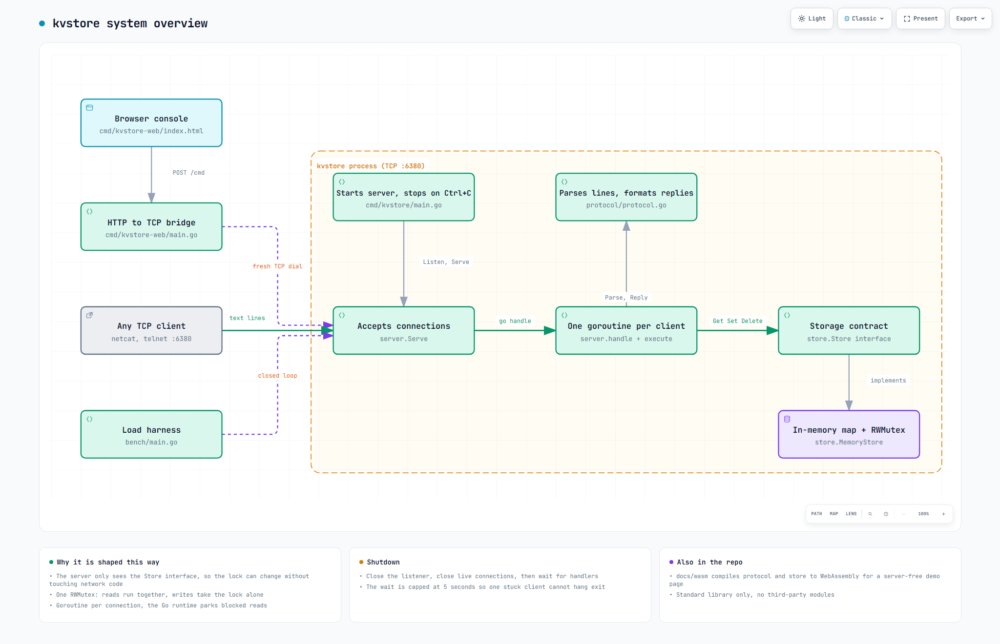
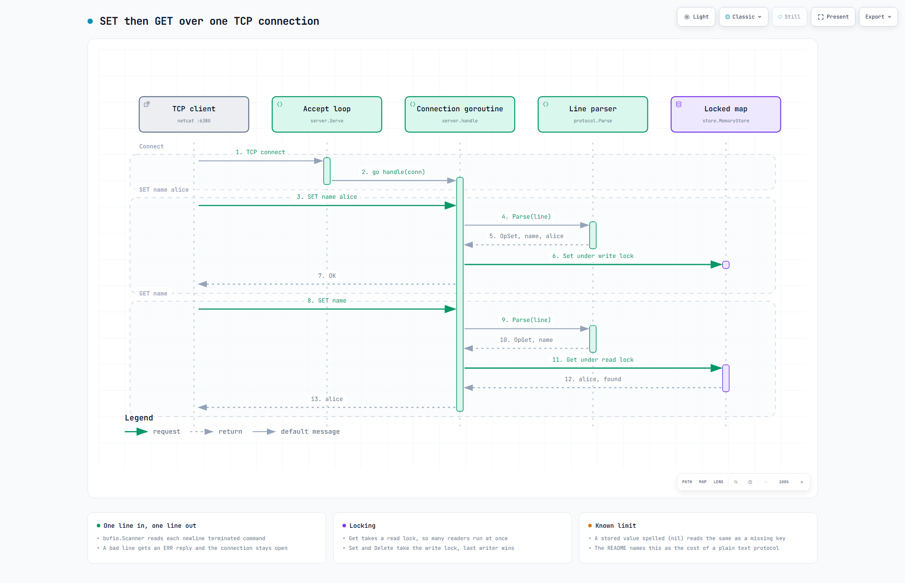
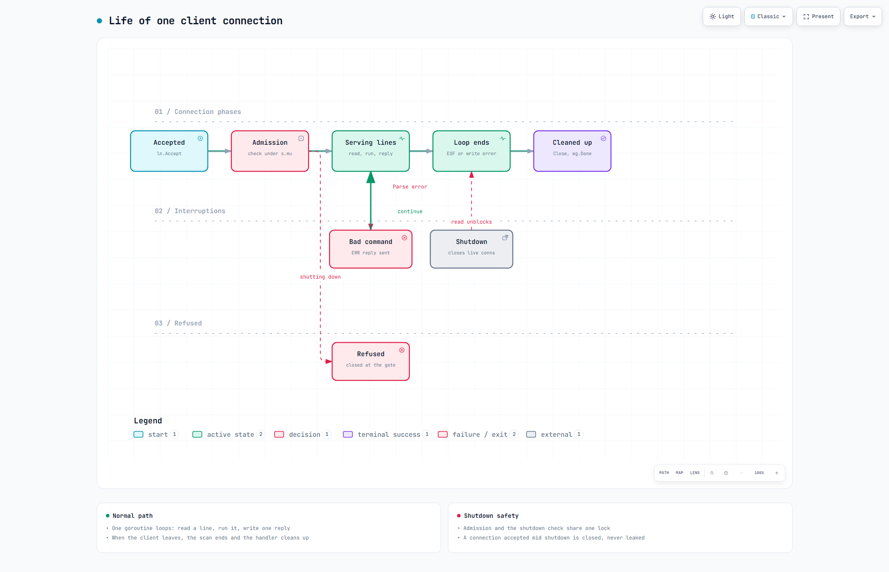

# kvstore

A small in-memory key value server in Go, inspired by Redis. TCP server,
one goroutine per connection, a mutex guarded map behind an interface, and a
line based text protocol. Standard library only, no dependencies.

## Run it

```
go run ./cmd/kvstore
```

It listens on :6380 by default. Change it with the addr flag:

```
go run ./cmd/kvstore -addr :7000
```

If you have make, `make run` does the same thing. On Windows the gcc
toolchains ship it as mingw32-make.

Talk to it with anything that speaks TCP. With netcat:

```
$ nc localhost 6380
SET name alice
OK
GET name
alice
DEL name
1
GET name
(nil)
```

Telnet or PowerShell's TcpClient work the same way.

## How it works

A client sends one text line over TCP, a goroutine for that connection parses it, runs it against a locked in-memory map, and writes one line back.


TCP clients reach the accept loop, each connection gets its own goroutine, and storage sits behind a small interface.


A numbered trace of `SET name alice` then `GET name` from the client socket to the map and back.


How a connection is admitted, serves lines, recovers from a bad command, and is closed by the client or by shutdown.

Interactive versions with pan, zoom and theme switch: `docs/diagrams/overview.html`, `docs/diagrams/main-flow.html`, `docs/diagrams/states.html`


## Browser demo

There is a small web console for showing the server to someone without a
terminal. It is a separate binary that talks to kvstore as an ordinary TCP
client, the core server is untouched.

```
go run ./cmd/kvstore          in one terminal
go run ./cmd/kvstore-web      in another
```

Then open http://localhost:8080 and type commands. Every line goes over the
wire exactly as shown in the console.

## Protocol

Commands are single lines, space separated, newline terminated.

```
SET key value    stores value under key, replies OK
GET key          replies the value, or (nil) if missing
DEL key          replies 1 if the key existed, 0 if not
```

The value in SET is everything after the key, so values can contain spaces.
Unknown or malformed commands get an ERR line back. One thing to know, a
stored value that is literally "(nil)" reads the same as a miss. That is a
real ambiguity in a plain text protocol and one of the reasons Redis uses a
typed wire format.

## Tests

```
go test ./...
go test -race ./...
go test -bench=. -benchmem ./store
```

The race run is the important one. The tests include concurrent writers
against the store and concurrent TCP clients against a live server, and the
whole suite passes under the race detector. Note that -race needs cgo, so on
Windows you need a gcc on the path.

## Benchmarks

```
go run ./bench                       spawns a server in-process and sweeps it
go run ./bench -addr host:port       loads a server you started yourself
```

Closed loop, so each client waits for its reply before sending again and the
percentiles are round trips somebody would actually feel. Every cell is run
several times and the median is reported next to its spread. `-clients`,
`-ops`, `-keys`, `-valsize`, `-runs`, and `-workloads` are all flags.

Committed numbers and the full method are in [bench/RESULTS.md](bench/RESULTS.md).
The short version, measured on a 6 core Ryzen over loopback with the server in
its own process: **over 100,000 ops/sec at 32 concurrent clients with p99 under
900µs**, saturating between 32 and 64 clients.

The design notes below used to say the lock was probably not worth sharding.
The benchmark settled it: the store answers a read in about 27ns, which is
under 0.4% of the per-operation budget at the rate the server actually
achieves. Nearly all of the cost is the socket, and specifically the reply
write, which is the next thing worth fixing.

## Layout

```
cmd/kvstore       main, flags, signal handling
cmd/kvstore-web   browser demo console, a TCP client behind an HTTP handler
server            TCP listener, connection handling, shutdown
protocol          text line in, command out, replies back to text
store             the map and its lock, behind an interface
bench             load harness, closed loop, percentiles and throughput
```

The server only knows the store interface, so the locking strategy can change
without touching network code. The protocol package knows nothing about
either.

## Design notes

Why one RWMutex and not something fancier. A cache workload leans read heavy,
and RWMutex lets any number of readers through at once while writes take the
lock alone. A channel owned map would avoid locks entirely but every read
would queue behind a single owner goroutine, and channels are really for
handing data off, this map is honestly shared state. A sharded map with N
locks scales writes better but costs a hash per operation and makes cheap
consistent snapshots impossible. The simple lock is obviously correct, and
because the store sits behind an interface it can be swapped for a sharded
one later without touching the server. If two clients write the same key at
once nothing corrupts, the lock serializes them and the last writer wins,
which is the same promise Redis makes for plain SET. Without the lock Go does
not limp along, the runtime detects concurrent map writes and kills the
process.

Why a goroutine per connection and not an event loop. In C the event loop is
how you serve many sockets cheaply, and it is what Redis itself does. In Go
the blocking style is the fast path. A goroutine starts with a few kilobytes
of stack, and when it blocks on a read the runtime parks it and multiplexes
the socket onto its internal poller, which uses epoll under the hood anyway.
So goroutine per connection compiles down to an event loop, except the
runtime maintains the state machine instead of me.

Why a text protocol and not RESP. The concurrency is the interesting part of
this project, not the wire format, and a line protocol can be debugged with
netcat. The cost is documented above, values cannot contain newlines and a
value spelled "(nil)" is ambiguous. RESP would fix both and would let the
real redis-cli connect, and it can slot in behind the same parse boundary
without the server or store changing.

Why shutdown looks the way it does. Every blocked operation needs something
to unblock it. Closing the listener frees the accept loop, closing live
connections frees their reads, then a WaitGroup waits for the handlers to
drain, capped by a timeout because a drain that can hang forever is not
graceful, it is a stuck process.

The web demo uses plain HTTP POST rather than WebSocket. The protocol is
strict request reply, one line in and one line out, so a stream adds nothing,
and the standard library has no WebSocket, so POST keeps the repo at zero
dependencies. The bridge dials a fresh connection per request on purpose, it
leaves no shared connection that needs a lock or reconnect logic.
